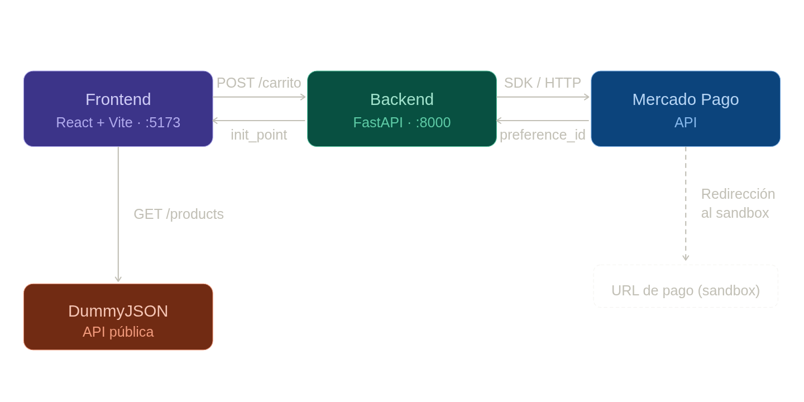

# Carrito — E-commerce con pago integrado vía Mercado Pago

Aplicación web de carrito de compras que conecta un frontend en React con un backend en FastAPI para procesar pagos a través de Mercado Pago. Los productos se obtienen de una API pública y el carrito se mantiene persistente en localStorage.



## Componentes del proyecto

| Carpeta | Tecnología | Puerto | Rol |
|---|---|---|---|
| `carrito/` | React 19 + Vite 8 | `5173` | Frontend: lista productos, gestiona carrito, envía pedido |
| `backend/` | FastAPI + Python 3.14 | `8000` | API: recibe carrito, crea preferencia en Mercado Pago |

## APIs externas e internas

| API | Endpoint | Propósito |
|---|---|---|
| DummyJSON | `GET https://dummyjson.com/products` | Obtener catálogo de productos (público, sin auth) |
| Backend propio | `POST http://localhost:8000/carrito` | Enviar carrito para generar link de pago |
| Mercado Pago | SDK de Python (`mercadopago`) | Crear preferencia de pado con los items del carrito |

## Requisitos

- **Node.js** >= 18 (para el frontend con Vite 8)
- **Python** >= 3.10 (para el backend con FastAPI)
- **pip** y entornos virtuales (se recomienda `venv`)

## Cómo levantar el proyecto

### 1. Backend

```bash
cd backend
python -m venv env
source env/bin/activate        # Linux/macOS
# env\Scripts\activate         # Windows

pip install -r requirements.txt   # o instala las dependencias listadas abajo

# Crea el archivo .env y pega tu token de desarrollador de MP
echo "TOKEN_DESARROLLO=TEST-XXXX-XXXX" > .env

uvicorn main:app --reload
```

### 2. Frontend

En otra terminal:

```bash
cd carrito
npm install
npm run dev
```

La app queda disponible en `http://localhost:5173`.

### 3. Probar el flujo completo

1. Abrir `http://localhost:5173`
2. Agregar productos al carrito
3. Ajustar cantidades con los botones `+` y `-`
4. Hacer clic en **Confirmar**
5. El frontend envía el carrito al backend (`POST /carrito`)
6. El backend crea una preferencia en Mercado Pago y devuelve la URL de pago
7. El navegador redirige al checkout de Mercado Pago (sandbox)

## Lecturas recomendadas

- **[README del frontend](./carrito/README.md)** — estructura, custom hooks, flujo de datos y preguntas didácticas
- **[README del backend](./backend/README.md)** — modelos, endpoint, SDK de Mercado Pago, CORS y configuración

## Funcionalidades generales

- [x] Catálogo de productos desde API externa
- [x] Agregar, eliminar y modificar cantidad de productos en el carrito
- [x] Cálculo automático del total
- [x] Persistencia del carrito en localStorage
- [x] Comunicación frontend ↔ backend vía API REST
- [x] Integración con Mercado Pago para generar link de pago
- [x] Redirección del usuario al checkout de Mercado Pago
- [ ] Autenticación de usuarios
- [ ] Historial de pedidos
- [ ] Filtros y búsqueda de productos
- [ ] Manejo de respuestas de pago (webhook)
